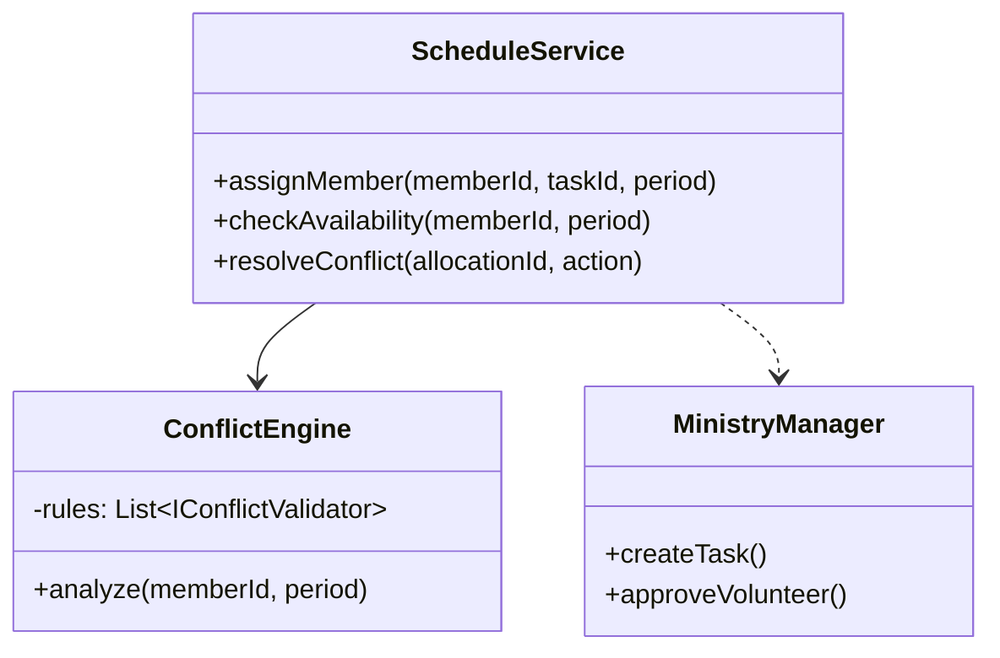

Como Arquiteto de Software Sênior, analisei os requisitos da Igreja Batista Betel. O desafio central não é apenas o cadastro, mas a **gestão de disponibilidade e a resolução de conflitos de agenda** em uma estrutura multidimensional (membros em múltiplos ministérios).

Para este cenário, recomendo uma abordagem de **Monólito Modular** seguindo os princípios da **Clean Architecture**. Um monólito modular facilitará o deploy e a consistência de dados (essencial para evitar conflitos de escala), enquanto a separação lógica permitirá que o sistema cresça de forma organizada.

Abaixo, apresento o plano base estruturado:

---

### 1. Visão Arquitetural

Utilizaremos **Domain-Driven Design (DDD)** para isolar as regras de negócio.

- **Módulo de Membros:** Gestão de perfis, competências e vínculos ministeriais.
- **Módulo de Ministérios:** Definição de papéis e permissões por ministério (Louvor, Mídia, Diaconia, Pastoral).
- **Módulo de Escalas (Core):** O "cérebro" do sistema. Gerencia eventos, tarefas e validação de conflitos.
- **Módulo de Notificações:** Avisos para gestores e membros via WhatsApp/E-mail.

### 2. Modelo de Dados Essencial (Entidades)

Para resolver o problema das tarefas simultâneas, precisamos distinguir entre **Evento** e **Alocação**.

- **Membro:** `ID, Nome, Tipo (Interno/Externo), Status, Ministérios[]`
- **Tarefa:** `ID, Nome, Descrição, NívelDeEsforço (Baixo/Alto), Categoria`
- **Escala (Alocação):** `ID, MembroID, TarefaID, DataInicio, DataFim, Status (Pendente/Confirmado)`

### 3. O Mecanismo de Conflitos (A Lógica de Negócio)

O ponto crucial é que nem todo conflito de horário é um bloqueio. Implementaremos o padrão **Strategy** para validar alocações.

#### Regras de Validação (Pseudo-algoritmo):

1. **Conflito Hard (Bloqueante):** Quando as tarefas exigem presença física exclusiva em locais diferentes ou funções incompatíveis (ex: Tocar guitarra vs. Segurança na porta).
2. **Conflito Soft (Aviso):** Quando as tarefas são compatíveis ou em horários sobrepostos mas permitidos (ex: Venda de sanduíche durante o intervalo do ensaio).

```typescript
// Exemplo de Interface para o Mecanismo de Validação
interface IConflictValidator {
    validate(newAllocation: Allocation, existingAllocations: Allocation[]): ValidationResult;
}

class WorkloadValidator implements IConflictValidator {
    validate(newAllocation, existingAllocations) {
        const overlap = existingAllocations.find(a => a.overlapsWith(newAllocation));
        if (overlap) {
            if (overlap.isExclusive || newAllocation.isExclusive) {
                return { status: 'CONFLICT', message: 'Membro já possui tarefa exclusiva neste horário.' };
            }
            return { status: 'WARNING', message: 'Membro possui outra atividade, mas a sobreposição é permitida.' };
        }
        return { status: 'SUCCESS' };
    }
}
```

### 4. Design de Classes para Gerenciamento de Escalas

Utilizaremos o padrão **Service Layer** para encapsular a lógica de agendamento:




### 5. Plano de Implementação (Roadmap)

#### Fase 1: Fundação (Sprints 1-2)

- Cadastro de Membros e Ministérios.
- Autenticação e RBAC (Role-Based Access Control):
  - **Pastoral:** Admin Total.
  - **Gestores:** Gerenciam apenas seu ministério.
  - **Membros:** Visualizam sua agenda.

#### Fase 2: O Motor de Escalas (Sprints 3-5)

- Criação de Eventos e Tarefas.
- Implementação do `ConflictEngine` (A lógica de aviso que você solicitou).
- **Agenda Unificada:** Uma visão "Master" onde a Pastoral vê todos os ministérios sobrepostos, e gestores vêem o impacto de suas escolhas.

#### Fase 3: Voluntariado e Notificações (Sprints 6-7)

- Módulo para membros externos se voluntariarem.
- Workflow de aprovação: Se um voluntário se candidata, o Gestor do Ministério recebe o alerta para aprovar/reprovar.
- Integração de Notificações (Observer Pattern) para avisar o membro: "Você foi escalado para o Louvor, mas já está na Mídia. Confirmar?"

### 6. Considerações de UX (User Experience)

Para os gestores, a interface deve ser visualmente clara:

- **Cor Vermelha:** Impossível alocar (Conflito Hard).
- **Cor Amarela:** Alerta de sobreposição (Conflito Soft - requer decisão humana).
- **Cor Verde:** Disponível.

### 7. Stack Tecnológica Recomendada

- **Backend:** Node.js com TypeScript ou C# .NET 8 (pela robustez no tratamento de regras de negócio).
- **Banco de Dados:** PostgreSQL (Relacional é superior aqui para cruzar agendas com eficiência).
- **Frontend:** React ou Angular com uma biblioteca de calendário robusta (ex: FullCalendar).

Este plano garante que a Igreja Batista Betel tenha não apenas um sistema de cadastro, mas uma **ferramenta de inteligência operacional** que evita a sobrecarga dos membros e organiza o serviço ministerial de forma harmoniosa.

Como Arquiteto, meu próximo passo seria detalhar os contratos de API. Deseja que eu elabore a estrutura de alguma funcionalidade específica, como o fluxo de aprovação de voluntários?