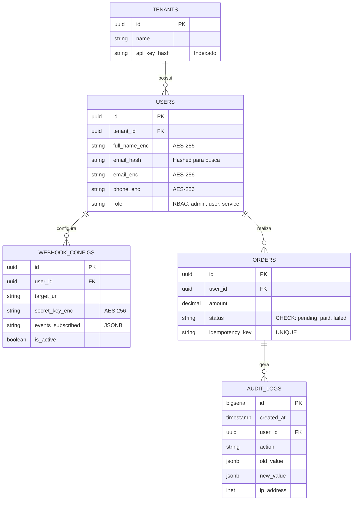

Como Engenheiro de Dados e Especialista em Segurança, minha prioridade é garantir a Confidencialidade, Integridade e Disponibilidade (CIA). Para uma arquitetura orientada a eventos que lida com Webhooks (dados de terceiros) e WebSockets (sessões de usuários), a modelagem deve ser rigorosa quanto à segregação de dados sensíveis e à trilha de auditoria.

Abaixo, apresento o DER (Diagrama Entidade-Relacionamento), a especificação de criptografia e as restrições de banco de dados.

---

## 1. Modelo de Dados (DER) - Notação Mermaid

Utilizaremos uma estratégia de Separation of Concerns, onde dados de autenticação, transações e logs de eventos residem em tabelas com diferentes níveis de acesso.



---

## 2. Especificação de Criptografia (AES-256)

Para conformidade com a LGPD/GDPR, não armazenamos PII (Personally Identifiable Information) em texto claro.

Técnica: AES-256-GCM (Galois/Counter Mode). O GCM é preferido pois oferece integridade e autenticação dos dados (AEAD).

Campos Criptografados:

USERS.full_name_enc: Nome completo do usuário.

USERS.email_enc: E-mail para comunicação direta.

USERS.phone_enc: Telefone/Celular.

WEBHOOK_CONFIGS.secret_key_enc: A chave usada para assinar os payloads dos Webhooks.

Busca em Campos Criptografados:

Como o AES-256 gera ciphertexts diferentes, para campos como e-mail que exigem busca (Login), utilizamos um Blind Index (um hash SHA-256 do valor original com um salt estático do sistema) armazenado em email_hash. Isso permite o SELECT sem descriptografar todos os registros.

---

## 3. Restrições e Integridade (PostgreSQL)

Para garantir que o banco de dados seja a última linha de defesa da integridade, aplicamos as seguintes restrições:

### A. Constraints de Negócio e Integridade

```sql
-- Garante que o status da ordem seja sempre válido
ALTER TABLE orders 
ADD CONSTRAINT chk_order_status 
CHECK (status IN ('pending', 'paid', 'failed', 'refunded'));

-- Impede ordens com valor negativo (Integridade Financeira)
ALTER TABLE orders 
ADD CONSTRAINT chk_positive_amount 
CHECK (amount >= 0);

-- Idempotência: Garante que um Webhook de provedor externo (ex: Stripe) 
-- não seja processado duas vezes se vier com a mesma chave.
ALTER TABLE orders 
ADD CONSTRAINT uq_idempotency_key 
UNIQUE (idempotency_key);
```

### B. Segurança e Controle de Acesso (RBAC)

Não utilizaremos o usuário postgres na aplicação.

```sql
-- Criando Roles Granulares
CREATE ROLE app_read_write;
CREATE ROLE app_audit_only;

-- RLS (Row Level Security): O usuário de um Tenant não pode ver dados de outro.
ALTER TABLE users ENABLE ROW LEVEL SECURITY;

CREATE POLICY tenant_isolation_policy ON users
USING (tenant_id = current_setting('app.current_tenant_id')::uuid);
```

### C. Gatilhos de Auditoria (Triggers)

Toda alteração em campos sensíveis dispara automaticamente uma inserção na tabela de audit_logs.

```sql
CREATE OR REPLACE FUNCTION log_user_changes() RETURNS TRIGGER AS $$
BEGIN
    INSERT INTO audit_logs (user_id, action, old_value, new_value, ip_address)
    VALUES (NEW.id, TG_OP, to_jsonb(OLD), to_jsonb(NEW), inet_client_addr());
    RETURN NEW;
END;
$$ LANGUAGE plpgsql;

CREATE TRIGGER trg_audit_users
AFTER UPDATE ON users
FOR EACH ROW EXECUTE FUNCTION log_user_changes();
```

---

## 4. Estratégia de Backup e Recuperação (DR)

Backup Contínuo (Point-in-Time Recovery - PITR):

Utilização do AWS Backup ou WAL-G para enviar os logs de transação (WAL) para o S3 a cada 5 minutos. Isso permite restaurar o banco para qualquer segundo específico em caso de ransomware ou erro humano.

Criptografia em Repouso:

O volume do EBS (disco do banco) deve ser criptografado com chaves gerenciadas pelo AWS KMS.

Backup Geográfico:

Snapshot diário replicado para uma região AWS diferente (ex: de us-east-1 para sa-east-1) para garantir continuidade em caso de desastre regional.

Próximo Passo: Com este modelo, os Webhooks podem salvar dados com segurança de idempotência, e os WebSockets podem consultar a tabela de orders via uma View segura que respeita a política de isolamento de Tenant.
