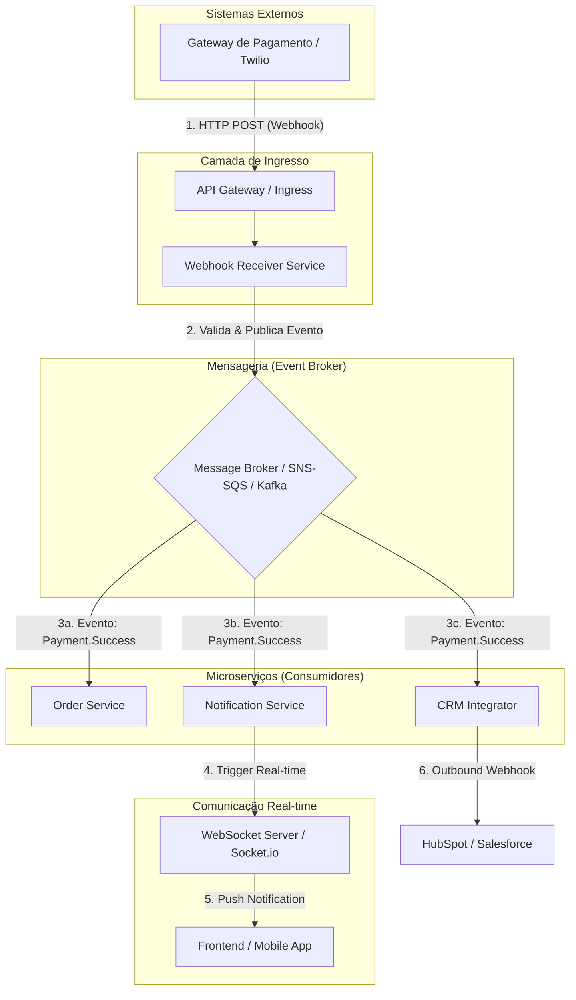

Como Engenheiro de Integração, meu objetivo é garantir que o dado flua de forma resiliente, desacoplada e escalável. Em uma arquitetura orientada a eventos (EDA - Event-Driven Architecture), o foco muda de "chamar uma função" para "reagir a um acontecimento".

Abaixo, apresento o esboço da arquitetura, o detalhamento técnico dos componentes de comunicação e as estratégias de resiliência.

---

## 1. Fluxograma da Arquitetura (Mermaid)

Este diagrama ilustra o ciclo de vida de um evento, desde a entrada via Webhook externo até a atualização em tempo real no Frontend via WebSocket.



---

## 2. Detalhamento dos Componentes

### A. Webhooks (A porta de entrada e saída)

O Webhook é uma comunicação HTTP Push assíncrona. Ele é essencial para evitar o polling (ficar perguntando ao servidor se algo mudou).

Webhook Inbound (Recebimento):

Contrato: Devemos expor um endpoint público (Ex: POST /v1/webhooks/payments).

Segurança: Implementação de HMAC Signature Verification. O serviço externo envia um hash no header; nós recalculamos e comparamos para garantir que a origem é legítima.

Ack Imediato: O serviço de recebimento valida o payload e responde 202 Accepted imediatamente. O processamento pesado não ocorre aqui para evitar timeout no provedor.

Webhook Outbound (Envio para Terceiros):

Quando nosso sistema precisa avisar o CRM do cliente.

Idempotência: Garantimos que, se enviarmos o mesmo evento duas vezes, o destino saiba lidar (usando um event_id único).

### B. WebSockets (Feedback em Tempo Real)

Enquanto o Webhook comunica sistemas (Server-to-Server), o WebSocket comunica o Servidor com o Usuário Final (Server-to-Client).

Conexão Full-Duplex: Ao contrário do HTTP, a conexão permanece aberta após o handshake.

Pub/Sub Pattern: O servidor de WebSocket escuta o Broker de Mensagens. Quando o evento Payment.Confirmed chega, ele identifica o user_id e faz o "push" apenas para o socket daquele usuário específico.

Escalabilidade: Como conexões WebSocket são persistentes (stateful), utilizamos um Redis Adapter para garantir que, se o usuário estiver conectado no Servidor A e o evento cair no Servidor B, a mensagem chegue até ele.

---

## 3. Estratégias de Resiliência (O "Pulo do Gato")

Como Engenheiro de Integração, eu implemento as seguintes salvaguardas para garantir que nenhum dado seja perdido:

Dead Letter Queues (DLQ): Se um evento falhar após X tentativas de processamento (ex: o CRM está fora do ar), ele é movido para uma fila de "mensagens mortas" para análise manual ou reprocessamento posterior.

Exponential Backoff (Retries): Em falhas de rede, o sistema tenta reenviar o Webhook em intervalos crescentes (1min, 5min, 15min, 1h).

Circuit Breaker: Se o serviço de WhatsApp (Twilio) começar a retornar erros 500 consecutivamente, o "disjuntor" abre. Paramos de enviar requisições por um tempo para não sobrecarregar o parceiro e evitar gargalos na nossa própria fila.

Event Schema Registry: Uso de contratos rigorosos (JSON Schema ou Protobuf) para garantir que o produtor do evento e o consumidor falem a mesma língua, evitando erros de parse em produção.

---

## 4. Exemplo de Contrato de Evento (JSON)

Para que a integração seja limpa, definimos um contrato padrão para o Broker:

```json
{
  "event_id": "evt_98765",
  "event_type": "payment.confirmed",
  "version": "1.0",
  "timestamp": "2023-10-27T14:30:00Z",
  "payload": {
    "order_id": "ord_123",
    "customer_id": "user_456",
    "amount": 150.00,
    "currency": "BRL"
  },
  "metadata": {
    "source": "stripe_gateway",
    "trace_id": "abc-123-xyz"
  }
}
```

Resultado Esperado: Com esta estrutura, o sistema é capaz de escalar horizontalmente. Se o tráfico de pagamentos triplicar, aumentamos apenas os consumers e o broker, sem afetar a experiência do usuário que recebe sua confirmação instantânea via WebSocket.
